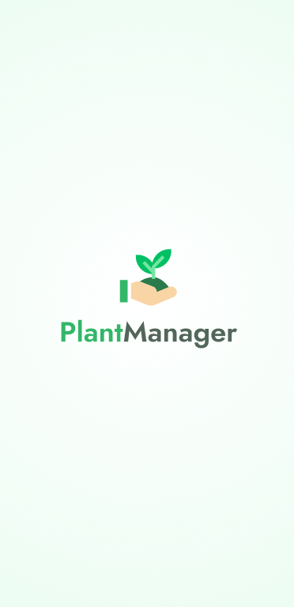
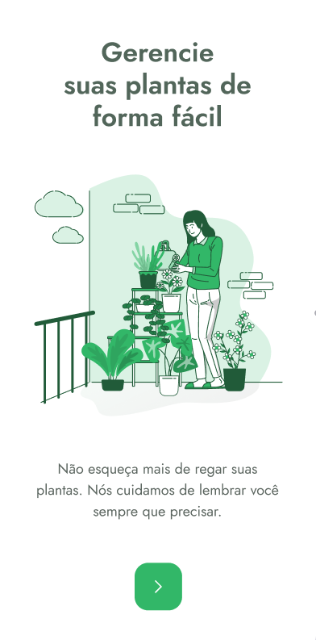

# Plant Manager App - React Native⚛ + Typescript + Styled components


<hr>

<h1 align="center">
    Bootcamp NLW#5
  

</h1>

<p align="center">
  <a href="#-Required">Required</a>&nbsp;&nbsp;&nbsp;|&nbsp;&nbsp;&nbsp;
  <a href="#-Project">Project</a>&nbsp;&nbsp;&nbsp;|&nbsp;&nbsp;&nbsp;
  <a href="#-Layout">Layout</a>&nbsp;&nbsp;&nbsp;|&nbsp;&nbsp;&nbsp;
  <a href="#-Challenge">Challenge</a>&nbsp;&nbsp;&nbsp;|&nbsp;&nbsp;&nbsp;
  <a href="#construction_worker-Execute">Execute</a>&nbsp;&nbsp;&nbsp;|&nbsp;&nbsp;&nbsp;
  <a href="#iphone-Run">Run</a>&nbsp;&nbsp;&nbsp;|&nbsp;&nbsp;&nbsp;
  <a href="#memo-License">License</a>
</p>

<p align="center">

  
  
  
  
</p>

<br>

<p align="center">
  
</p>

## 🚀 Required
[Node](https://nodejs.org/en/download/)
[Yarn](https://yarnpkg.com/)
[Android Studio](https://developer.android.com/studio)

## 💻 Project
<p>App developed on React Native path  of NLW#5. This app will help people to take care of nature, in a easiest way 🍃.</p>

<!-- <br>
My web version of this project can be found here [Git -  Plant Manager App WEB]().
<br> -->

If you are looking for this project download or seeing online, try this options below:<br>
[📲 Android APK download - 🏗 On Development]()<br>

<!-- [💻 Hosted on Netlify]()<br>
[💻 Hosted on Vercel]()<br> -->

## 🔖 Layout

You can find the base layout here 👉 [Figma - Plant Manager Mobile](https://www.figma.com/file/68psTCsgiPxxE1zyNHT6Ur/PlantManager-Copy?node-id=0%3A1).


## 🧠 How i moved this project to the next level

[ ] Converted from ReactNative to ReactJS . <br>
[ ] Creating workflow with Github hooks to generated a Android APK artefact.<br>
✅ Adding  ESLint, Prettier, Git commit lint.<br>
[ ] Adding  styled-components and navigation.<br>
[ ] Creating custom hooks that can be reusable on Web and Mobile.<br>
[ ] Adding Async Storage.<br>
[ ] Share the learning with others.<br>
✅ Stay sharp on both platforms.<br>

## :construction_worker: How to execute

```bash
# Clone repository
$ git clone https://github.com/sunderhus/plantmanager
```
### :iphone: Run

```bash
# clone and open on your favorite IDE, in my case Visual Studio Code.
$ cd plantmanager && code .

# install all dependencies.
$ yarn

#👽 run in Android device emulator .
$ yarn android

#🍎 run in  Ios device emulator .
$ yarn ios
```

## :memo: License

This project is under MIT License. check-out this file here 👉 [LICENSE](LICENSE.md).

---


Made by Matheus Sunderhus : [Linkedin!](https://www.linkedin.com/in/matheus-sunderhus/)


